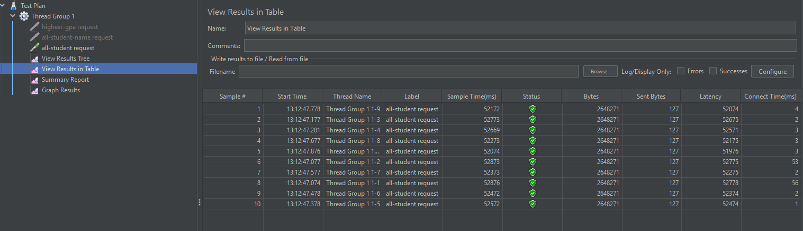
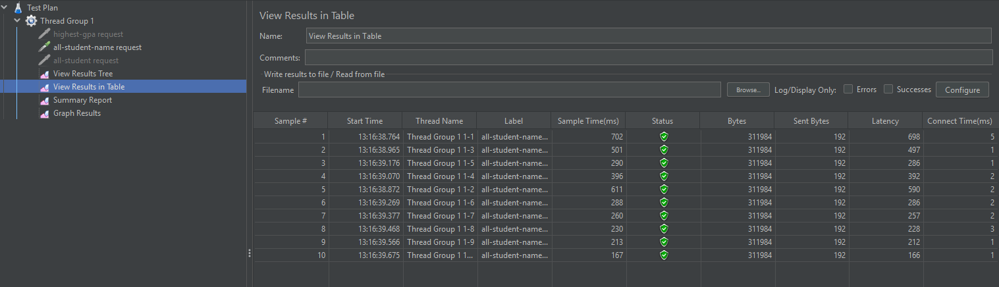
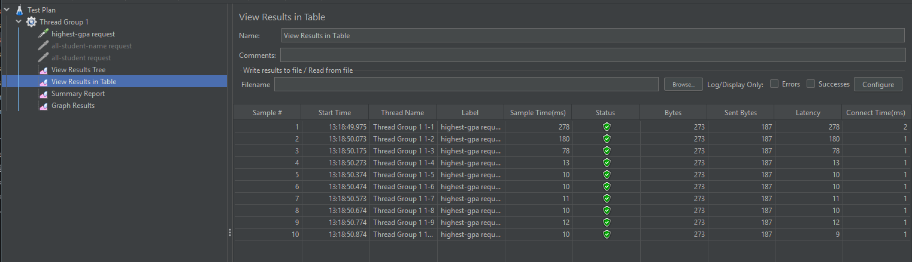

Performance result (sebelum optimasi) : 

- All-student :
  

- All-student-name :
  

- Highest-gpa :
  

- All-student (CLI) :

  

- All-student-name (CLI) :

  

- Highest-gpa (CLI) :

  

Performance result (setelah optimasi) : 
- All-student :
  

- All-student-name :
  

- Highest-gpa :
  

Conclusion : 
Perbandingan hasil JMeter sebelum dan sesudah optimasi menunjukkan peningkatan yang cukup signifikan. Berikut penjelasan detailnya : 
- all-student : Sebelumnya, rata-rata sample timenya berada di sekitar 131000 ms atau 131 detik. Hal ini sanggat lambat dikarenakan
query N+1 yang dieksekusi berkali-kali untuk 10 thread. Namun, setelah optimasi, rata-rata sample time turun menjadi 52000ms atau 52 detik.
Terjadi peningkatan sekitar 60%.
- all-student-name : Sebelumnya, rata-rata sample timenya berada di 4500 ms atau 4.5 detik. Setelah dilakukan optimasi dengan penggantian
cara string concatenation dengan StringBuilder, rata-rata sample timenya turun ke 200 - 700 ms atau lebih dari 85%.
- highest-gpa : Sebelumnya, rata-rata sample timenya berada di 150 - 400ms. Setelah dilakukan optimasi dengan menyerahkan pencarian
nilai tertinggi ke database, hal ini terbukti jauh lebih efisien. Hasilnya, rata-rata sample time turun ke 10 - 13 ms pada beberapa sample
atau sekitar 90%.

Reflection Notes : 
1. Dalam konteks optimasi performa, pendekatan JMeter dan IntelliJ Profiler sedikit berbeda. JMeter lebih fokus pada external performance testing 
dimana untuk mengukur sejauh mana suatu aplikasi dapat menangani beban dari banyak pengguna secara bersamaan. Dengan kata lain, 
JMeter mengukur throughput dan latency. Sementara itu, IntelliJ Profiler fokus pada internal profiling untuk melihat konsumsi
resource pada setiap bagian kode sehingga kita bisa tahu bagian kode mana yang menjadi beban bagi sistem. Dengan itu, kita bisa
melakukan optimasi pada bagian kode tersebut.

2. Proses profiling dapat merekam proses jalannya aplikasi dan memberikan beberapa visualisasi hasil seperti Flame Graph 
dan Method List. Masing-masing visualisasi ini memberikan kita informasi mengenai detail setiap method yang dijalankan seperti
waktu eksekusi CPUnya. Dari sini, kita bisa mengidentifikasi method mana yang memiliki waktu eksekusi CPU paling lama sehingga
kita dapat memperbaikinya.

3. Menurut saya, fitur IntelliJ Profiler ini sangat efektif karena langsung terintegrasi dengan IDE sehingga membuat proses
identifikasi dan analisis performa menjadi jauh lebih cepat dan mudah. Ada juga beberapa fitur seperti Comparison View yang 
memudahkan kita untuk membandingkan seberapa efektif optimasi yang sudah kita lakukan berdasarkan data.

4. Selama melakukan performance testing dan profiling, menurut saya, salah satu tantangan terbesarnya ada pada variasi hasil
yang terjadi akibat faktor eksternal yang tidak bisa kita kontrol seperti kondisi mesin kita saat itu. Hal ini mengakibatkan
setiap test memiliki hasil yang berbeda-beda. Untuk mengatasinya, saya melakukan warm up terlebih dahulu dengan mengakses endpoint
beberapa kali sebelum akhirnya benar-benar diukur. Hal ini untuk membuat mesin kita lebih siap dan kita dapat hasil yang lebih stabil.

5. Bagi saya, manfaat terbesar yang saya dapatkan dari IntelliJ Profiler adalah kemampuan untuk melihat masalah yang kadang 
tidak terlihat di permukaan sehingga kita sering terlewat, padahal hal itu sangat mempengaruhi peforma. Salah satu contoh dari 
pengerjaan tutorial ini yaitu masalah N+1 query pada database yang sangat tidak efisien. Profiler memberikan kita suatu data
yang dapat kita gunakan untuk mengubah kode yang sekadar jalan menjadi lebih efisien.

6. Jika hasil JMeter dan Profiler berbeda, saya biasanya melihatnya dari dua sudut pandang berbeda dan bukan sebagai konflik karena
memang keduanya memiliki fokus yang berbeda. Profiler memberikan informasi di level kode seperti bottleneck pada method tertentu, sedangkan
JMeter representasi kondisi nyata dengan beban dan concurrency. Saya akan mengecek mengecek ulang skenario testingnya dan mengusahakan
agar keduanya sebanding, misalnya memastikan input, jumlah user, dan environment yang mirip. Selain itu, saya juga akan menganalisis perbedaan
tersebut sebagai petunjuk tambahan, seperti adanya kemungkinan overhead di jaringan. Dengan pendekatan ini, saya bisa mendapatkan
gambaran performance secara keseluruhan.

7. Strategi saya dalam optimasi kode aplikasi yaitu pertama analisis dan identifikasi terlebih dahulu hal-hal yang biasanya menurunkan
efisiensi secara signifikan seperti logika loop atau pemilihan struktur data yang salah. Setelah itu, saya akan mencari solusi alternatif 
yang melakukan hal serupa tetapi lebih efisien. Untuk memastikan perubahan tersebut tidak mempengaruhi fungsionalitas aplikasi, saya melakukan 
berbagai pengujian, baik melalui bantuan seperti Postman atau unit testing setelah setiap perubahan dilakukan sehingga output dan fungsionalitas
tetap terjaga.